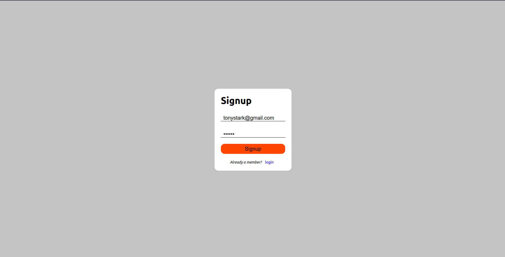
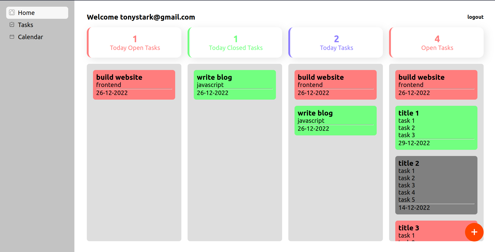
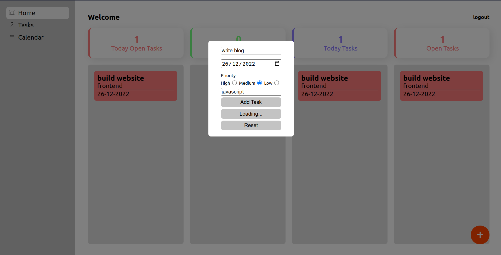
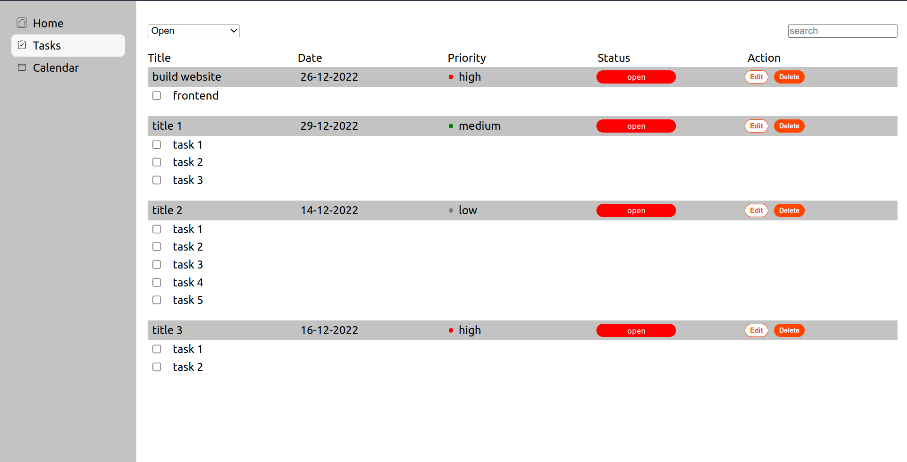
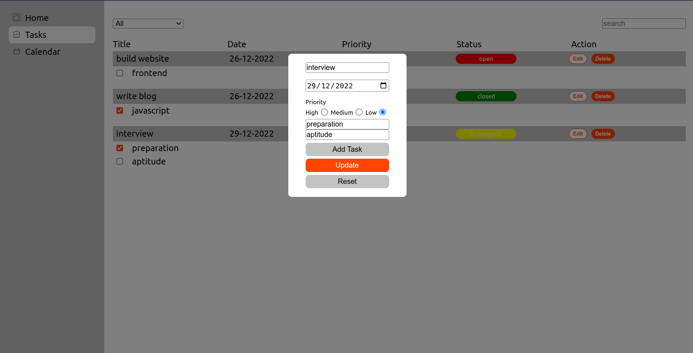
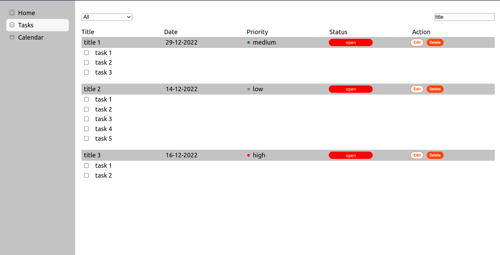
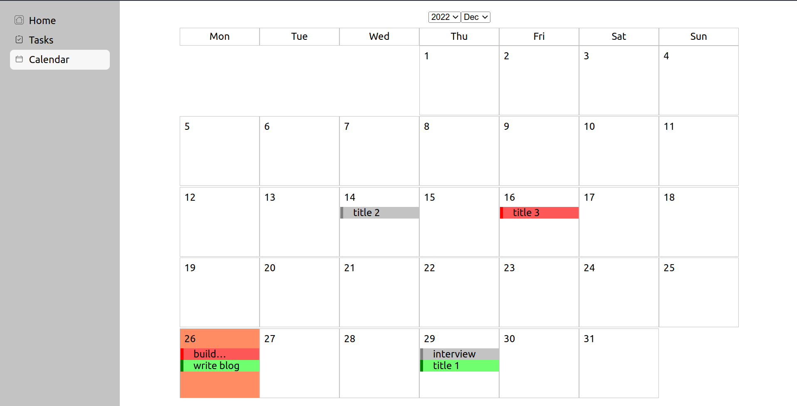

#   Task App - MERN Stack

**Login Signup**

**Dashboard**

**Create Task**

**Task List**

**Edit Task**

**Task List with Filters and Search**

**Calendar**

---

-   A Simple Task app build with React, Express, Mongoose, Node
-   Built in 1 week

---